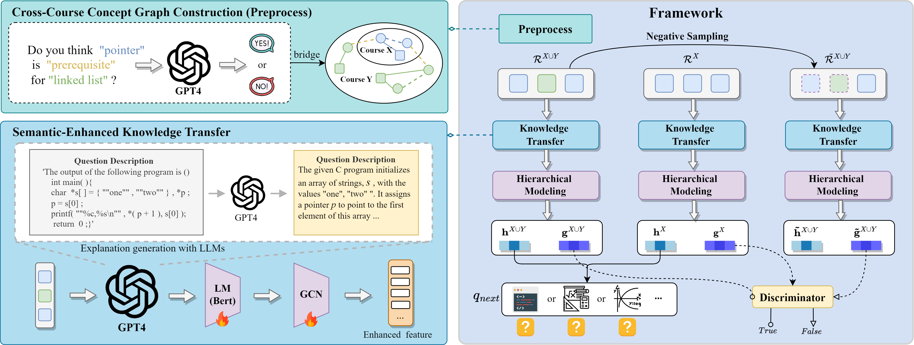

# TransKT
Contrastive Cross-Course Knowledge Tracing via Concept Graph Guided Knowledge Transfer


Considering the relevance and transferability of learners' cross-course learning behaviors, we propose the TransKT framework to provide a more comprehensive and accurate understanding of learners' knowledge states for reliable prediction on the knowledge tracing task.
## 🌟Overview


The framework of TransKT. First, during preprocessing, TransKT employs GPT-4 to complete the concept-to-concept links both within and between courses, bridging individual concept graphs. Next, TransKT utilizes a semantic-enhanced knowledge transfer module, which leverages an LLM-to-LM pipeline to summarize and extract rich semantic features for GCN-based knowledge propagation. Following this, through hierarchical modeling, TransKT derives both interaction-level and course-level knowledge states. Finally, TransKT employs a contrastive learning objective to enhance the robustness of representations for prediction by maximizing mutual information between single-course and cross-course knowledge states.


For more details, please read our paper: "**Contrastive Cross-Course Knowledge Tracing via
Concept Graph Guided Knowledge Transfer**"
## ➡️Quick Start
### Installation
Git clone this repository and creating conda environment:
```bash
conda create -n transkt python=3.8
conda activate transkt
pip install -r requirements.txt 
```
### Create directory
Unzip the TransKT dataset files and create training, testing, and validation sets:
```bash
unzip C_DS_dataset.zip  # Take C&DS dataset for example.
python split.py
```
Establishing the directory for the output file of the optimal model:
```bash
mkdir trained
```
Establishing the directory for the output files of training and testing logs:
```bash
mkdir logs
```
### Training & Testing
Our model experiments are conducted on a Tesla A800, with actual VRAM requirements of around 10 GB. You can execute it directly using Python commands.
```python
CUDA_VISIBLE_DEVICES=3 python -u main.py --lr 0.0001 --batch_size 128 --model_id ours --num_epoch 200 --gnn 2  --optim adamw  --IM 1 \
    --lambda 0.6 --eta 0.7  --warm_epoch 0 > logs/test.log 2>&1&
```
You can also choose to directly execute the shell script in the command line:
```bash
bash start.sh
```


## 📌Detailed information

In this paper, the publicly available [PTADisc](https://github.com/wahr0411/PTADisc?tab=readme-ov-file) dataset (sourced from the [PTA](https://pintia.cn/)) is further processed to obtain four sub-datasets, each specifically designed to support the Cross-Course Knowledge tracing (**CCKT**) task.


### Dataset statistics

| Dataset       | Java&Python | C&DS   | C&Java | CS&MA |
|---------------|-------------|--------|--------|--------|
| #Records     | 1,129,999       | 1,800,066  | 1,501,414  | 282,135
| #Learners     | 7,770        | 12,275  | 9,618  |2,431
| #Quetions     | 5,734/7,562  | 10,957/9,641 | 11,934/7,624 | 5,870/1,386
| #Concepts     | 360/364     | 362/323 | 424/408 |359/140


## 🎉Acknowledgment
* We further processed the publicly available [PTADisc](https://github.com/wahr0411/PTADisc?tab=readme-ov-file) dataset to obtain the cross-course knowledge tracing dataset.